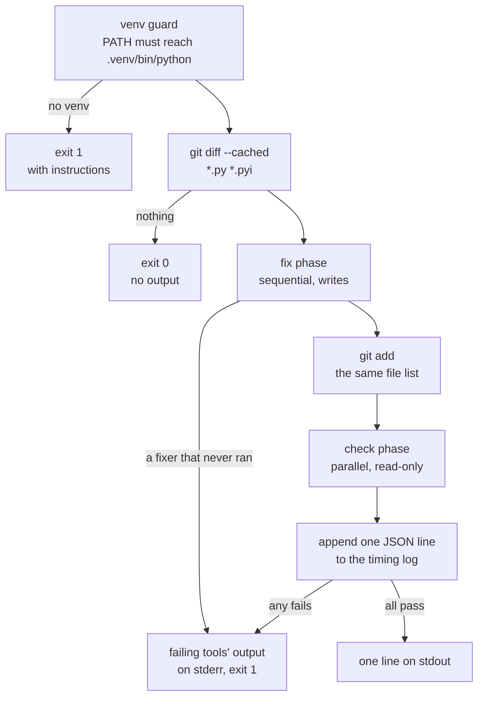
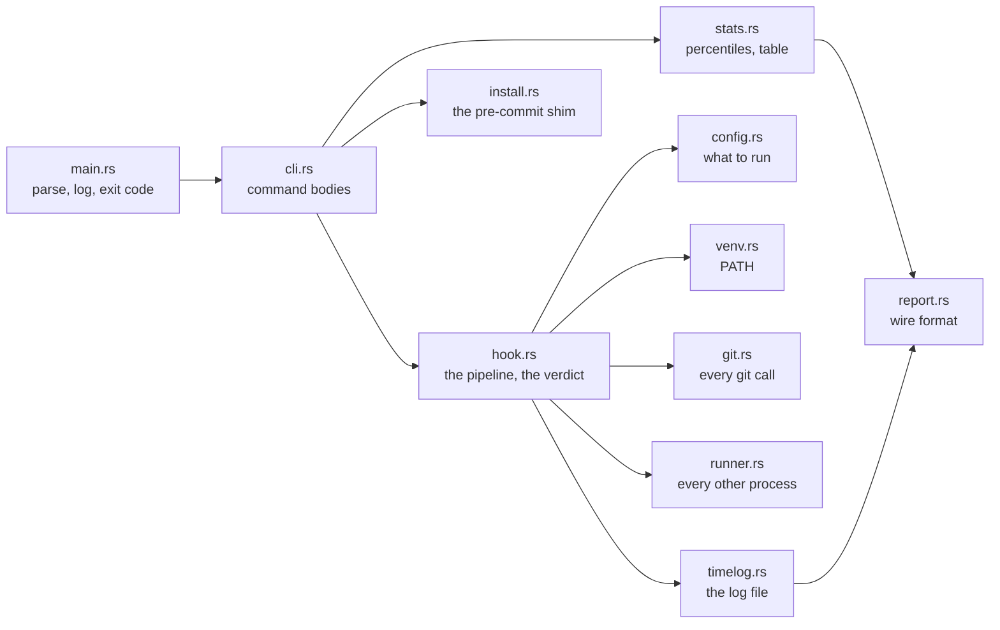

# How it works

## The pipeline

The log is written before the verdict is printed, so a run is timed whether or
not it was allowed through. A fixer that exits non-zero is not a reason to
refuse the commit — `ruff check --fix` exits non-zero for what it could not
fix, and the check that follows is about to say so — but a fixer that *never
ran* is: no check reports a missing `ruff format`, and the commit would record
unformatted code under a verdict claiming it was formatted.

Fix steps run one at a time and in configuration order, because they rewrite
the same files and the formatter has to see the linter's output. Checks are
read-only, so they all run at once, each on its own thread with its own capture
of stdout and stderr. Each step times itself inside its thread, so what the log
records is how long the tool took and not how long it waited to be joined.

## Shape of the crate

`main.rs` stays thin: argument parsing, tracing setup, exit-code mapping. Every
command body lives in `cli.rs` or in the module it delegates to.

Anything that spawns a process or touches the filesystem lives behind a named
seam, and everything downstream of a seam takes already-parsed data. `venv.rs`
is the clearest case: the guard's decision is a pure function of the current
`PATH` and a filesystem oracle, so all four of its branches are unit-tested on
a machine with no virtualenv at all. See
[`docs/adr/`](https://github.com/mojzis/madoqua/tree/main/docs/adr) for the
decisions and what they cost.
