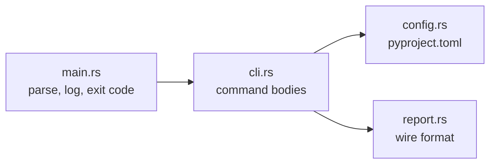

# How it works

TODO: the pipeline, once there is one.

## Shape of the crate

`main.rs` stays thin: argument parsing, tracing setup, exit-code mapping. Every
command body lives in `cli.rs` or in the module it delegates to.

Anything that spawns a process or touches the filesystem lives behind a named
seam, and everything downstream of a seam takes already-parsed data. That is
what keeps the rules unit-testable with no external tools installed. See
[`docs/adr/`](https://github.com/mojzis/madoqua/tree/main/docs/adr) for the
decisions and what they cost.
